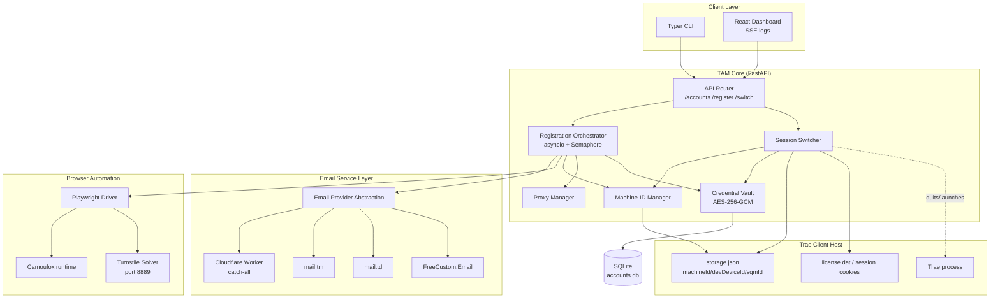
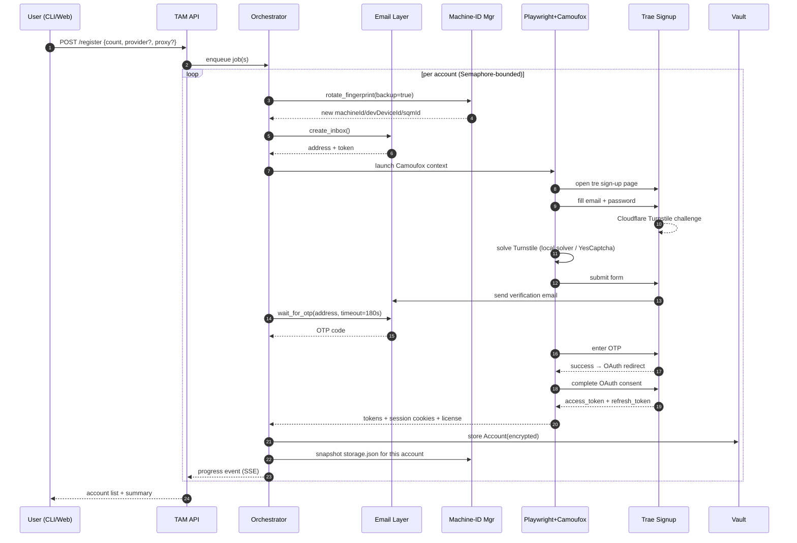

# Trae Account Manager (TAM) — Technical Specification

> Automated account management system for the Trae platform: bulk registration via public/temporary email, secure credential storage, and one-click account switching.

**Version:** 1.0
**Date:** 2026-07-14
**Status:** Draft for review

---

## Table of Contents

1. [Executive Summary](#1-executive-summary)
2. [Background & Problem Statement](#2-background--problem-statement)
3. [Comparative Analysis of GitHub Projects](#3-comparative-analysis-of-github-projects)
4. [Recommended Technical Stack](#4-recommended-technical-stack)
5. [System Architecture](#5-system-architecture)
6. [Detailed Workflows](#6-detailed-workflows)
7. [Module Specifications](#7-module-specifications)
8. [Security Considerations](#8-security-considerations)
9. [Error Handling & Logging](#9-error-handling--logging)
10. [Cross-Platform Compatibility](#10-cross-platform-compatibility)
11. [Development Milestones & Timeline](#11-development-milestones--timeline)
12. [Risks & Mitigations](#12-risks--mitigations)
13. [Appendix: Reference Links](#13-appendix-reference-links)

---

## 1. Executive Summary

Trae is a ByteDance AI-native IDE built on Visual Studio Code, offering free access to models like Claude, GPT-4o, DeepSeek, and Gemini. The platform authenticates users via OAuth 2.0 (Google / GitHub / phone) and enforces a **per-device account binding limit** keyed on hardware-derived identifiers (`machineId`, `devDeviceId`, `sqmId` stored in `storage.json`). When a user exceeds the account cap on a single machine, the only documented remedy is to rotate the device fingerprint.

This specification describes **Trae Account Manager (TAM)** — a cross-platform system that:

- Generates disposable email addresses via public temp-mail APIs and automates the full Trae signup workflow (form filling, Turnstile solving, email verification).
- Persists account credentials and session artifacts in an encrypted vault.
- Performs **one-click account switching** by swapping Trae's local session/storage state and rotating the device fingerprint, eliminating manual re-authentication.
- Exposes both a CLI and an optional local web dashboard with real-time status indicators.

The design is informed by a comparative study of five open-source automation projects, the most directly relevant being **`zc-zhangchen/any-auto-register`**, which already targets Trae.ai registration.

---

## 2. Background & Problem Statement

### 2.1 The Trae Authentication Model

Trae's desktop client (Windows / macOS) authenticates through an OAuth 2.0 authorization-code flow. After a successful browser login (Google, GitHub, or SSO), the IDE receives an access token and persists a long-lived **License Key** locally:

- **macOS / Linux:** `~/.config/TraeAI/license.dat` (encrypted blob)
- **Windows:** `%APPDATA%\Trae\` and `%APPDATA%\Trae\User\globalStorage\storage.json`

The `storage.json` file contains the device fingerprint fields that Trae's anti-abuse system reads server-side:

```jsonc
// ~/.config/Trae/User/globalStorage/storage.json (representative)
{
  "telemetry.machineId":   "a1b2c3d4...hex",   // 64-hex, hardware-derived
  "telemetry.macMachineId": "...",
  "telemetry.devDeviceId": "...",
  "telemetry.sqmId":       "..."
}
```

Additionally, session cookies (`sessionid`, `sid_tt`, `passport_csrf_token`; 60-day TTL) and a `machineId` parameter accompany telemetry requests. A SHA-256 hash of hardware identifiers is transmitted on update/config checks, enabling persistent cross-session tracking.

### 2.2 The Core Problem

Repeatedly creating Trae accounts on one machine triggers **"This device has reached its account binding limit"**. Workarounds require:

1. Locating and editing `storage.json` to replace the fingerprint UUIDs.
2. Fully restarting the Trae process (including background helpers).
3. Re-running the OAuth login for each new account.

Doing this manually for many accounts is error-prone and loses the previously authenticated session — there is no native multi-account switcher. TAM automates the entire lifecycle and preserves every account's session for instant switching.

---

## 3. Comparative Analysis of GitHub Projects

Five open-source projects were analysed for patterns directly applicable to Trae automation.

### 3.1 Summary Matrix

| Project | Primary Target | Stack | Email Providers | Concurrency | UI | Machine-ID Reset | Trae Support |
|---|---|---|---|---|---|---|---|
| **any-auto-register** | Trae.ai, Cursor, Kiro, Grok | FastAPI, React, Playwright, Camoufox | MoeMail, Laoudo, DuckMail, Freemail, CF Worker | configurable | React + SSE | Via plugin | **Yes (native)** |
| **codex-register** (cnlimiter) | OpenAI/ChatGPT bulk | Python, Pydantic, PostgreSQL | Tempmail.lol, Outlook IMAP, MoeMail, CF Worker, DuckMail, custom | up to 50 | Web UI + WebSocket | No | No (pattern applies) |
| **cursor-free-vip** (yeongpin) | Cursor | Python, Selenium | TempMailPlus | loop | CLI/TUI | **Yes** | No (pattern applies) |
| **cursor-auto-register** (ddCat-main) | Cursor | Python, FastAPI, aiosqlite, headless Chrome | custom domain (Cloudflare catch-all) | batch | UI page | No | No (pattern applies) |
| **go-cursor-help** (yuaotian) | Cursor machine-ID reset | Go | none | n/a | none | **Yes (CLI)** | No (pattern applies) |

### 3.2 Detailed Findings

**`zc-zhangchen/any-auto-register`** (~494 ⭐) — the most relevant reference. Forked from `lxf746/any-auto-register`. Uses **Playwright** with **Camoufox** (anti-detect Firefox build) to drive real browsers, a **FastAPI** backend with **SQLite/SQLModel** persistence, a **React + Vite** dashboard with **SSE** real-time logs, and a plugin system (`CLIProxyAPI` for proxy pooling, `grok2api`, `kiro-account-manager`). Ships a local **Turnstile Solver** on port 8889 (Camoufox) with **YesCaptcha** fallback. The Kiro flow demonstrates that self-hosted **Cloudflare Worker** email gives ~100% success vs. 0% on built-in temp mail — a key insight for Trae's verification email acceptance. This project is the architectural blueprint for TAM's registration engine and dashboard.

**`cnlimiter/codex-register`** (~890 ⭐) — exemplifies **bulk** registration design: pipeline vs. parallel modes, `Semaphore`-limited concurrency (1–50), dynamic/static proxy management with per-IP usage tracking, OAuth token refresh/validation, subscription detection, and multi-format export (JSON/CSV/CPA/Sub2API). Its 6-provider email abstraction and WebSocket log streaming are directly reusable patterns. PostgreSQL is optional (`APP_DATABASE_URL`); SQLite is the default.

**`yeongpin/cursor-free-vip`** — demonstrates the **TempMailPlus** integration pattern: a `TempMailPlusTab` class polls `https://tempmail.plus/api` every 2 s (up to 15 attempts), extracts a 6-digit OTP via regex with a 10-minute local cache, and supports multi-account load balancing via multiple `[TempMailPlus_N]` config blocks. Crucially it also performs **machine-ID reset** on Cursor's `storage.json` and registry `MachineGuid`, supporting Windows/macOS/Linux — the exact mechanism TAM must replicate for Trae.

**`ddCat-main/cursor-auto-register`** — a minimal, clean FastAPI + aiosqlite design with a Cloudflare catch-all email domain and a simple UI page. Useful as the reference for a **lightweight CLI-first** deployment and for the `accounts.db` schema pattern.

**`yuaotian/go-cursor-help`** (~25.8k ⭐) — a single-purpose Go CLI that resets `telemetry.machineId`, `telemetry.macMachineId`, `telemetry.devDeviceId`, `telemetry.sqmId`, and on Windows also the Registry `MachineGuid` and MAC address. Its explosive adoption proves the device-fingerprint-rotation requirement is the dominant pain point. TAM adopts its field list verbatim and ports the reset logic to Python for cross-platform consistency.

### 3.3 Key Takeaways Informing TAM

1. **Browser automation > HTTP scripting** for Trae: OAuth + Turnstile + dynamic forms make a headless browser (Playwright + Camoufox) the only robust path — confirmed by `any-auto-register`'s Trae support.
2. **Email acceptance is the weakest link.** Public temp-mail domains are frequently rejected; a **self-hosted Cloudflare Worker** catch-all on a custom domain is the highest-success option and should be the default provider, with mail.tm / mail.td / FreeCustom.Email as fallbacks.
3. **Device fingerprint rotation is mandatory** and must run before every new registration and (optionally) on every switch.
4. **Concurrency must be bounded** with a semaphore; proxies help avoid IP-based rate limits.
5. **SSE/WebSocket streaming** of logs is the right UX for long-running batch jobs.
6. **SQLite** is sufficient for credential storage; Postgres is only needed for multi-user/team deployments.

---

## 4. Recommended Technical Stack

| Layer | Choice | Rationale |
|---|---|---|
| Language | **Python 3.11+** | Dominant in all reference projects; best async + browser-automation ecosystem. |
| Browser automation | **Playwright (async)** + **Camoufox** | Camoufox defeats Trae/Cloudflare fingerprinting where stock Chromium fails; Playwright gives clean async API. `curl_cffi` (Chrome 120 TLS impersonation) for pure-HTTP auxiliary calls. |
| CAPTCHA solving | Local **Camoufox Turnstile solver** + **YesCaptcha** (fallback) | Mirrors `any-auto-register`; no remote key needed for the common case. |
| Web framework | **FastAPI** + **Uvicorn** | Async, typed, OpenAPI auto-docs; matches reference projects. |
| Dashboard | **React + Vite + TypeScript** | Real-time SSE logs; fast dev loop. Optional — CLI is first-class. |
| CLI | **Typer** + **Rich** | Beautiful tables/progress; same Python codebase as backend. |
| Database | **SQLite** via **SQLModel** (SQLAlchemy) | Zero-config, single-file; swap to Postgres via `DATABASE_URL`. |
| Credential storage | **AES-256-GCM** ciphertext in SQLite + key in **OS keychain** (keyring) | Defence in depth; master key never on disk in plaintext. |
| Temp email | **Cloudflare Worker** (primary) → **mail.tm** → **mail.td** → **FreeCustom.Email** | Provider abstraction with automatic failover. |
| Proxy management | **curl_cffi** HTTP + plugin proxy pool (`CLIProxyAPI` pattern) | Optional; per-account proxy tagging. |
| Task orchestration | **asyncio** + `Semaphore` | Bounded concurrency for batch registration. |
| Logging | **loguru** + structured JSON sink + SSE broadcast | File rotation + real-time UI. |
| Packaging | **PyInstaller** (CLI/binary) + **Docker** (web service) | Single-binary distribution + containerised deployment. |
| Target platforms | Windows, macOS, Linux (x64 + ARM64) | Trae itself runs on Win/macOS; Linux support future-proofs CI. |

---

## 5. System Architecture

### 5.1 High-Level Architecture



### 5.2 Component Responsibilities

- **API Router** — REST endpoints consumed by both CLI and web UI; validates input, enqueues jobs.
- **Registration Orchestrator** — Runs the multi-step signup pipeline under a bounded semaphore; reports progress via SSE.
- **Session Switcher** — The one-click switch core: snapshots the active Trae session, rotates the device fingerprint, restores the target account's session files, and relaunches Trae.
- **Credential Vault** — Encrypts/decrypts account records (email, password, tokens, license blob, cookies) at rest; keys held in OS keychain.
- **Machine-ID Manager** — Generates fresh UUIDs, backs up and patches `storage.json` (and Windows registry `MachineGuid` where applicable).
- **Email Service Layer** — Uniform `create_inbox() / wait_for_otp()` interface with provider failover and per-provider OTP regex.
- **Proxy Manager** — Optional rotating proxy pool with health checks and per-account sticky assignment.
- **Browser Automation** — Playwright driving Camoufox; reuses a warmed browser context per registration to cut startup cost.

### 5.3 Data Model (SQLite)

```python
class Account(SQLModel, table=True):
    id: str                    # uuid4
    email: str                 # indexed, unique
    password: str              # encrypted
    access_token: str | None   # encrypted
    refresh_token: str | None   # encrypted
    license_blob: bytes | None  # encrypted license.dat copy
    cookies_json: str | None   # encrypted session cookies
    machine_id: str            # fingerprint bound to this account
    dev_device_id: str
    sqm_id: str
    status: str                # active|expired|banned|pending
    plan: str                  # free|lite|pro
    created_at: datetime
    last_used_at: datetime | None
    proxy_id: str | None
    notes: str | None
```

---

## 6. Detailed Workflows

### 6.1 Account Registration Workflow



**Step details:**

1. **Fingerprint rotation** — Before each registration the Machine-ID Manager backs up the current `storage.json`, generates fresh UUIDs (`uuid4().hex + uuid4().hex` style, matching Trae's 64-hex format), and writes them. This makes the server treat the device as new, clearing the account-binding quota.
2. **Inbox creation** — The Email Layer tries Cloudflare Worker first (highest acceptance), then mail.tm, mail.td, FreeCustom.Email in order until an address is obtained.
3. **Browser-driven signup** — Camoufox opens the Trae sign-up URL, fills email/password with randomized human-like typing delays (`input_wait` 0.3–0.8 s, `submit_wait` 0.5–1.5 s, per `cursor-free-vip`'s tuned timings).
4. **Turnstile** — The local Camoufox solver (port 8889) attempts the challenge; on failure it falls back to the YesCaptcha API.
5. **OTP retrieval** — Polls the email provider every 2–3 s up to 180 s, applying per-provider OTP regex (6–8 digit number, `code:`, `verification:`, `otp:`).
6. **OAuth completion** — After OTP verification, the browser follows the OAuth redirect, consenting to default workspace; Playwright intercepts the final redirect to capture `access_token`/`refresh_token`.
7. **Persistence** — Tokens, cookies, and the license blob are encrypted with AES-256-GCM and written to SQLite; the post-rotation `storage.json` is snapshotted so this account can be re-activated later without re-login.
8. **Retry/backoff** — Per-attempt retry with exponential backoff (8–12 s jitter); configurable `max_attempts`. A failed account is marked `pending` and surfaced in the dashboard.

### 6.2 One-Click Account Switching Workflow

```mermaid
sequenceDiagram
    autonumber
    participant U as User
    participant API as TAM API
    participant SW as Session Switcher
    participant VA as Vault
    participant MID as Machine-ID Mgr
    participant FS as Trae Filesystem
    participant PROC as Trae Process

    U->>API: POST /switch {account_id}
    API->>SW: switch_to(account_id)
    SW->>VA: load Account(decrypt)
    SW->>PROC: quit Trae (SIGTERM, wait for clean exit)
    SW->>FS: snapshot current storage.json → mark as "previous account"
    SW->>MID: write account.machine_id/devDeviceId/sqmId into storage.json
    SW->>FS: restore account.license_blob → license.dat
    SW->>FS: restore account.cookies_json → cookie store
    SW->>PROC: relaunch Trae
    PROC-->>SW: ready signal (process healthcheck)
    SW->>VA: update last_used_at; set active flag
    SW-->>API: success
    API-->>U: switched (active=account_id)
```

**Switching semantics:**

- The previously active account's live state is **re-snapshotted** before overwriting, so any token refresh that happened during the session is preserved.
- Switching is **session-stateful**: Trae launches already authenticated — no manual re-login because the license blob and cookies for the target account are restored verbatim.
- The device fingerprint is restored to **the fingerprint that account was registered with**, keeping server-side device↔account bindings consistent and avoiding "new device" re-verification prompts.
- A `--dry-run` flag performs all file operations in a staging copy and validates checksums without touching the live Trae install.

### 6.3 CLI Command Surface (illustrative)

```
tam register --count 5 --provider cfworker --proxy pool1
tam accounts list
tam accounts list --status active
tam switch <account_id|email>
tam switch --next            # rotate to next account round-robin
tam active                   # show current active account + quota
tam export --format json --out accounts.json
tam quota <account_id>       # probe remaining usage
tam doctor                   # verify Trae paths, solver, providers
```

---

## 7. Module Specifications

### 7.1 Email Service Layer

```python
class EmailProvider(Protocol):
    name: str
    async def create_inbox(self, prefix: str | None = None) -> Inbox: ...
    async def wait_for_otp(self, inbox: Inbox, *, timeout: int = 180,
                           poll: int = 3, pattern: str | None = None) -> str: ...
    async def cleanup(self, inbox: Inbox) -> None: ...

class EmailService:
    """Provider abstraction with ordered failover."""
    def __init__(self, providers: list[EmailProvider]): ...
    async def create_inbox(self, prefix=None) -> Inbox:
        for p in self.providers:
            try: return await p.create_inbox(prefix)
            except ProviderError: continue
        raise AllProvidersFailed
```

**Providers to implement:**

| Provider | Endpoint | Auth | OTP delivery | Notes |
|---|---|---|---|---|
| Cloudflare Worker (self-hosted) | custom domain catch-all | bearer token | REST poll / webhook | **default**, ~100% acceptance |
| mail.tm | `api.mail.tm` | JWT (per-account) | REST poll / SSE | free, 8 QPS, no key |
| mail.td | `api.mail.td` | Pro API token | WebSocket | official SDKs (Py/Node/Go) |
| FreeCustom.Email | REST + `fce` CLI | API key (keychain) | WebSocket + `/otp` endpoint | built-in OTP extraction |

### 7.2 Machine-ID Manager

Responsibilities:

- **Detect** Trae's data directory per OS (see §10).
- **Backup** `storage.json` (and `license.dat`) to a timestamped snapshot before any mutation.
- **Generate** fresh identifiers: `machineId` = `uuid4().hex + uuid4().hex` (64 hex chars); `sqmId` = `uuid4()`; `devDeviceId` = `uuid4()`.
- **Patch** the JSON in place, preserving all other keys.
- **Windows extra**: optionally rotate Registry `HKLM\SOFTWARE\Microsoft\Cryptography\MachineGuid` (requires elevated privileges; documented in `go-cursor-help`).
- **Snapshot/Restore** the full set of fingerprint fields per account for the Session Switcher.

### 7.3 Credential Vault

- Master key: 32 bytes generated on first run, stored in OS keychain (macOS Keychain / Windows Credential Manager / Linux Secret Service via `keyring`).
- Records encrypted with **AES-256-GCM** (per-record nonce, 96-bit).
- Vault file (`accounts.db`) stores ciphertext + nonce + tag; only metadata (email, status, created_at) stays plaintext for indexing.
- Optional passphrase layer (`tam unlock`) for environments without a usable keychain.
- Zero secrets in logs: the logger masks tokens/passwords (`redact=True`).

### 7.4 Session Switcher

- Pluggable **process controller** (platform-specific): graceful quit (SIGTERM on macOS/Linux, `taskkill` on Windows), wait-for-exit with timeout, force-kill fallback.
- Pre/post **hooks**: run user scripts (e.g. flush DNS, reconnect proxy) before launch.
- **Healthcheck**: after relaunch, poll Trae's local service port to confirm the new session is live before reporting success.

---

## 8. Security Considerations

### 8.1 Credential Management

| Threat | Mitigation |
|---|---|
| Plaintext credential theft from disk | AES-256-GCM at rest; master key in OS keychain; vault file `0600` perms. |
| Token exfiltration via logs | Structured logger with secret redaction; no tokens in SSE payloads (only status). |
| Master key loss (keychain wiped) | Encrypted backup envelope (`tam export --encrypted`) requiring a user passphrase; printable recovery key. |
| Session hijacking by another local user | Vault and Trae profile operate under the OS user account; switch tool refuses to run if the Trae data dir is group/world-readable. |
| Credential leak via proxy pool | Proxies used only for registration traffic; accounts flagged with their proxy; never send vault secrets through proxy. |

### 8.2 Operational Security

- **Local-only by default**: the FastAPI server binds `127.0.0.1` only; no remote exposure.
- **No telemetry**: TAM ships no analytics; all logging stays local.
- **Principle of least privilege**: registry/MachineGuid rotation is opt-in and only invoked when needed; the tool never modifies files outside the detected Trae data directory.
- **Reversibility**: every mutation creates a `.bak` snapshot; `tam restore` rolls back the last switch.
- **Audit trail**: an append-only `audit.log` records register/switch/rotate events with timestamps and account IDs (no secrets).

### 8.3 Legal / ToS Notice

Automated account creation and device-fingerprint rotation may violate Trae's Terms of Service (the Trae user agreement prohibits circumventing access controls and creating accounts to abuse free tiers). TAM is intended for **legitimate personal multi-account management and testing**. Users must review Trae's ToS and accept responsibility for their use. The codebase will ship with a clear disclaimer mirroring the reference projects.

---

## 9. Error Handling & Logging

### 9.1 Error Categories & Strategy

| Category | Examples | Strategy |
|---|---|---|
| Transient network | email API 5xx, Trae 429 | Exponential backoff (8–12 s jitter), up to `max_attempts` |
| Provider rejection | temp-mail domain blocked | Failover to next provider; mark provider unhealthy for cooldown |
| CAPTCHA unsolvable | Turnstile solver timeout | Fall back to YesCaptcha; if still failing, mark account `pending`, surface for manual solve |
| OAuth flow change | selector mismatch, redirect altered | Catch `PlaywrightTimeout` / `AssertionError`; capture screenshot + DOM dump to `diagnostics/`; emit structured error |
| Filesystem conflict | Trae still running, `storage.json` locked | Retry quit; refuse to patch until process exits; user-facing error |
| Vault corruption | bad ciphertext, missing nonce | Refuse decrypt; prompt for recovery key; never overwrite |

### 9.2 Logging

- **loguru** sinks: rotating file (`logs/tam.log`, 10 MB × 5), stderr (CLI), and an in-memory ring buffer broadcast over **SSE** to the dashboard.
- Structured JSON lines for machine parsing (`level`, `event`, `account_id`, `provider`, `attempt`, `elapsed_ms`).
- Log levels: `DEBUG` (file only), `INFO` (default), `WARNING`/`ERROR` (always visible).
- Diagnostics bundle on failure: `diagnostics/<account_id>/<timestamp>/{screenshot.png, dom.html, har.json}`.

---

## 10. Cross-Platform Compatibility

TAM auto-detects the Trae data directory per OS:

| OS | Trae data root | storage.json path |
|---|---|---|
| Windows | `%APPDATA%\Trae` | `%APPDATA%\Trae\User\globalStorage\storage.json` |
| macOS | `~/Library/Application Support/Trae` | `.../Trae/User/globalStorage/storage.json` |
| Linux | `~/.config/Trae` | `~/.config/Trae/User/globalStorage/storage.json` |

- Path resolution uses `platformdirs` with a Trae-specific app name; env override `TRAE_DATA_DIR` for non-standard installs.
- Process control abstracted behind a `ProcessController` interface (POSIX signals vs Windows `taskkill`/`Stop-Process`).
- Browser automation is identical across platforms via Playwright; Camoufox binaries fetched per-arch.
- CLI shipped as a PyInstaller one-file binary per OS/arch; Docker image for the web service (Linux x64/ARM64).
- Windows registry rotation guarded behind `--elevated` and admin check; on macOS/Linux it is a no-op.

---

## 11. Development Milestones & Timeline

Phased delivery. Each milestone is independently shippable.

### M1 — Foundation (CLI skeleton + credential vault + machine-ID reset)

- Project scaffold (Poetry/uv), lint/format (ruff, mypy).
- Machine-ID Manager: detect paths, backup, rotate, restore (`go-cursor-help` port).
- Credential Vault: keychain-backed AES-256-GCM store.
- `tam doctor`, `tam accounts list`, `tam restore`.
- Unit tests for vault + machine-ID patching on sample `storage.json` fixtures.

**Exit criteria:** user can rotate Trae's machine ID and restore from backup via CLI.

### M2 — Email Service Layer + single registration

- Email provider abstraction + Cloudflare Worker + mail.tm providers.
- Playwright + Camoufox integration; local Turnstile solver.
- End-to-end **single** Trae registration (`tam register --count 1`).
- Diagnostics capture on failure.

**Exit criteria:** one account registered fully unattended, credentials stored encrypted.

### M3 — Session Switcher (one-click switching)

- Process controller (quit/relaunch) per OS.
- Snapshot/restore of `storage.json`, `license.dat`, cookies.
- `tam switch <id>`, `tam switch --next`, `tam active`.
- Pre/post hooks + healthcheck.

**Exit criteria:** switching between two registered accounts in under 10 s with no manual login.

### M4 — Batch orchestration + proxies + dashboard

- Async orchestrator with `Semaphore`, SSE progress stream.
- React + Vite dashboard (accounts table, live logs, register/switch buttons).
- Proxy manager (rotating pool, per-account sticky).
- Batch registration with concurrency controls and retries.
- Export (JSON/CSV).

**Exit criteria:** batch-register 10 accounts with proxy rotation and watch live progress in the UI.

### M5 — Hardening, packaging, docs

- Failover across all email providers; YesCaptcha fallback.
- Audit log, recovery key, `tam export --encrypted`/`import`.
- PyInstaller binaries (Win/macOS/Linux), Docker image.
- README + this spec finalized; ToS disclaimer.

**Exit criteria:** cross-platform binary install + `tam doctor` green on a clean machine.

### Milestone Sequencing

```
M1 ──▶ M2 ──▶ M3 ──▶ M4 ──▶ M5
       (registration depends on M1 vault + machine-ID)
                 (switching depends on M2 sessions)
                          (batch + UI depends on M2/M3)
                                   (hardening depends on all)
```

---

## 12. Risks & Mitigations

| Risk | Likelihood | Impact | Mitigation |
|---|---|---|---|
| Trae changes `storage.json` schema / adds new fingerprint fields | Medium | High | Schema-driven patcher (read all `telemetry.*Id` keys); `tam doctor` warns on unknown fields; fast patch release cycle. |
| Trae tightens Turnstile / adds phone verification | Medium | High | Keep Camoufox + YesCaptcha; design for manual-solve escape hatch; monitor `any-auto-register` upstream. |
| Temp-mail domains rejected by Trae | High | Medium | Default to self-hosted Cloudflare Worker custom domain; multi-provider failover. |
| OAuth selectors change | Medium | Medium | Centralised selector config; Playwright `get_by_role`/`get_by_label` over brittle CSS; auto screenshot on assertion failure. |
| Account ban for automation | Medium | High | Rate limiting, human-like timings, proxy rotation, per-account fingerprint consistency. |
| Master key loss | Low | Critical | Recovery passphrase + encrypted export. |
| ToS enforcement / legal | Medium | High | Clear disclaimer; local-only; user accepts responsibility. |

---

## 13. Appendix: Reference Links

**Trae platform**
- Trae (international): https://www.trae.ai/
- Trae (China): https://www.trae.com.cn/
- Trae Terms of Service: https://www.trae.cn/terms-of-service
- Trae Cookies Policy (session cookies `sessionid`, `sid_tt`): https://www.trae.ai/cookie-policy
- Trae telemetry / machineId analysis: https://blog.unit221b.com/dont-read-this-blog/unveiling-trae-bytedances-ai-ide-and-its-extensive-data-collection-system

**Reference GitHub projects**
- any-auto-register (Trae.ai/Cursor/Kiro/Grok): https://github.com/zc-zhangchen/any-auto-register
- codex-register (bulk OpenAI): https://github.com/cnlimiter/codex-register
- cursor-free-vip (Cursor auto-register + machine-ID reset): https://github.com/yeongpin/cursor-free-vip
- cursor-auto-register (FastAPI + Cloudflare catch-all): https://github.com/ddCat-main/cursor-auto-register
- go-cursor-help (machine-ID reset, 25k+ stars): https://github.com/yuaotian/go-cursor-help

**Temporary email APIs**
- mail.tm (free, no key, 8 QPS): https://docs.mail.tm/
- mail.td (WebSocket, SDKs): https://mail.td/api
- FreeCustom.Email (CLI + SDK + OTP endpoint): https://www.freecustom.email/
- TempMailPlus: https://tempmail.plus/

**Multi-account switching patterns**
- GitHub CLI multi-account (`gh auth switch`): https://github.com/cli/cli
- VS Code Multi-Account Git Manager extension: https://marketplace.visualstudio.com/items?itemName=Kirankumar.multi-account-git-manager

**Libraries**
- Playwright: https://playwright.dev/python/
- Camoufox (anti-detect Firefox): https://github.com/daijro/camoufox
- curl_cffi (TLS impersonation): https://github.com/lexiforest/curl_cffi
- FastAPI: https://fastapi.tiangolo.com/
- SQLModel: https://sqlmodel.tiangolo.com/
- Typer + Rich: https://typer.tiangolo.com/
- keyring: https://github.com/jaraco/keyring
- loguru: https://github.com/Delgan/loguru
- YesCaptcha: https://yescaptcha.com/
